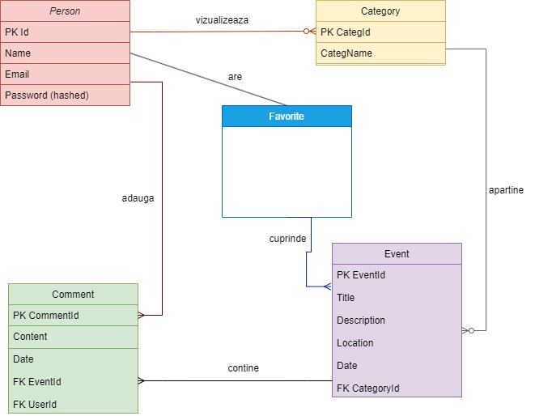

# Events-App
**TONIGHT APP**

  TONIGHT este o aplicatie web care are ca scop usurearea procesului de luare a deciziei privind
locatia si activitatile pentru o seara de vineri. Aceasta aplicatie ofera o solutie rapida si distractiva
pentru a gasi evenimente, activitati si restaurante in zona ta, in functie de preferintele si bugetul tau.
Pentru a utiliza aplicatia, utilizatorii trebuie sa se autentifice in sistem si sa aleaga orasul in care se
afla. Apoi, aplicatia afiseaza o lista cu toate evenimentele, activitatile si restaurantele disponibile in
acea seara, impartite pe categorii, inclusiv petreceri, evenimente culturale, entertainment, sporturi,
restaurante si multe altele. Utilizatorii pot naviga prin lista si pot selecta activitatile care se potrivesc
cel mai bine cu preferintele lor.
  Daca utilizatorii sunt indecisi si au mai multe preferinte, aplicatia ofera posibilitatea adaugarii
evenimentelor preferate in lista de favorite. Aplicatia foloseste o baza de date cu informatii actualizate despre evenimente si locatii din orasul nostru.
  TONIGHT este o solutie rapida si distractiva pentru a gasi evenimente si
activitati in zona ta, oferind o varietate de optiuni pentru toate preferintele si bugetele.

## Must Have

-   User registration and login with secure authentication.

-   Ability to browse for events happening tonight, including dinner
    clubs and cultural events.

-   Basic information for each event, such as location, start time, and
    description.

## Should Have

-   Option to save events to a wish list or favorites, for future
    reference.

-   Integration with location services to provide accurate and relevant
    event recommendations.

-   Simple filtering options, such as by location or category.

-   Social sharing and invite features, to enable users to share events
    with friends and family.

## Nice to Have

-   Ability to book tickets or reservations for an event, using a secure
    payment gateway.

-   In-app messaging system, to allow users to communicate with event
    organizers or other attendees.

-   Real-time updates and notifications for event changes,
    cancellations, or delays.

-   User-generated content, such as reviews or ratings, to enable users
    to share their feedback and opinions about events.

## User stories

As a foodie, I want to be able to explore different dinner clubs
happening tonight in my city, so that I can have a unique culinary
experience.

As a cultural enthusiast, I want to be able to discover cultural events
happening tonight, such as art exhibitions, theater plays, or musical
performances, so that I can enjoy a night of entertainment.

As a busy professional, I want to be able to quickly find an event
happening tonight that fits my schedule and interests, so that I can
have a relaxing and enjoyable evening after work.

As a tourist, I want to be able to see a list of recommended dinner
clubs and cultural events happening tonight, sorted by location and
popularity, so that I can experience the local culture and cuisine.

As a group organizer, I want to be able to see a list of events
happening tonight that can accommodate my group size, preferences, and
budget, so that I can plan a memorable night out with my friends.

As a loyal customer, I want to be able to receive notifications and
updates about upcoming dinner clubs and cultural events that match my
previous attendance and preferences, so that I can stay informed and
engaged.

As a last-minute planner, I want to be able to book tickets or
reservations for a dinner club or cultural event happening tonight, even
if it\'s already close to the start time, so that I can still make
spontaneous plans and enjoy my evening.

